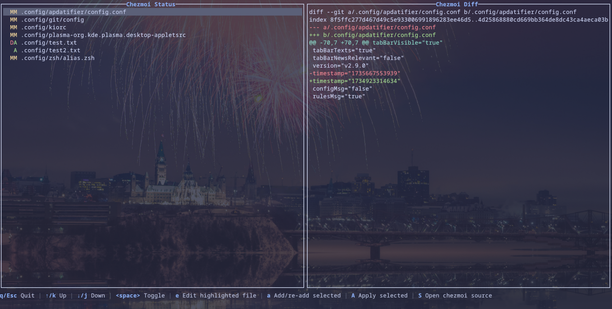

# Lazychezmoi

**Lazychezmoi** is a [Ratatui](https://ratatui.rs) app to manage your [chezmoi](https://chezmoi.io) dotfiles.

Heavily inspired by [lazygit](https://github.com/jesseduffield/lazygit).

> [!WARNING]
> This project is in early development. Development is exclusively done on Linux.
> Features and designs decisions are still being made. See the [Roadmap](#roadmap).



## Table of contents

<!-- toc -->

- [Features](#features)
  - [Coloured diff and file states](#coloured-diff-and-file-states)
  - [Interactive file management](#interactive-file-management)
  - [Integrated chezmoi commands](#integrated-chezmoi-commands)
- [Usage](#usage)
  - [Keybindings](#keybindings)
  - [Installation](#installation)
    - [Requirements](#requirements)
    - [Manual installation](#manual-installation)
- [Roadmap](#roadmap)
  - [Design ideas](#design-ideas)
  - [Feature ideas](#feature-ideas)
  - [CICD](#cicd)

<!-- tocstop -->

## Features

### Coloured diff and file states

- `chezmoi status` with colour-coded file states
- Coloured diff view

### Interactive file management

- Select/deselect files using <space>
- Add/Re-add selected files to chezmoi source directory
- View detailed diff for each single file

### Integrated chezmoi commands

- Shortcut to open chezmoi source directory (i.e. `chezmoi edit`)
- Shortcut to edit a file in the chezmoi source (i.e. `chezmoi edit <file>`)

## Usage

### Keybindings

- `↑/k`: Navigate up
- `↓/j`: Navigate down
- `Space`: Toggle file selection
- `e`: Edit highlighted file in source
- `a`: Add/re-add selected files
- `A`: Apply selected files
- `S`: Open chezmoi source directory
- `q/Esc`: Quit application

### Installation

#### Requirements

- [chezmoi](https://chezmoi.io)
- `rust`/`cargo` ([installation instructions](https://www.rust-lang.org/tools/install))

#### Manual installation

```sh
git clone https://github.com/abiencourt/lazychezmoi.git
cd lazychezmoi
cargo run
```

## Roadmap

### Design ideas

- [ ] Implement 2 additional panes to see files selected "to re-add" and "to apply"
  - [ ] Right now, if you select a mix of "re-add" and "apply" file, it might cause unwanted behaviour

### Feature ideas

- [ ] Add a "discard" keymapping that will present "local" and/or "source" changes option to discard
- [ ] Integration with `lazygit` to see source
- [ ] Add `chezmoi git` commands

### CICD

- [ ] Deploy to cargo registry
- [ ] Deploy to [brew.sh](https://brew.sh)
- [ ] Deploy to AUR
- [ ] Add automated testing
- [ ] Test on Windows and MacOS
